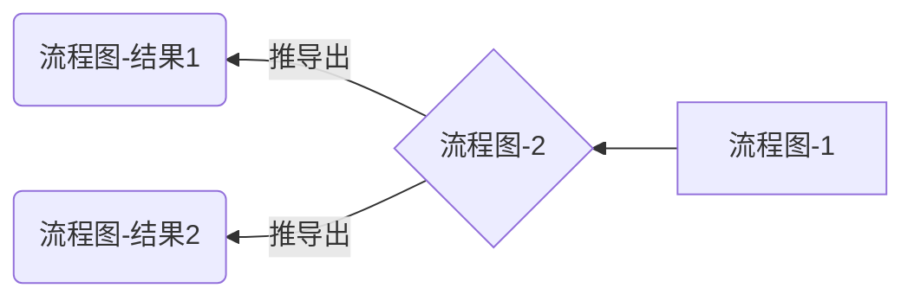
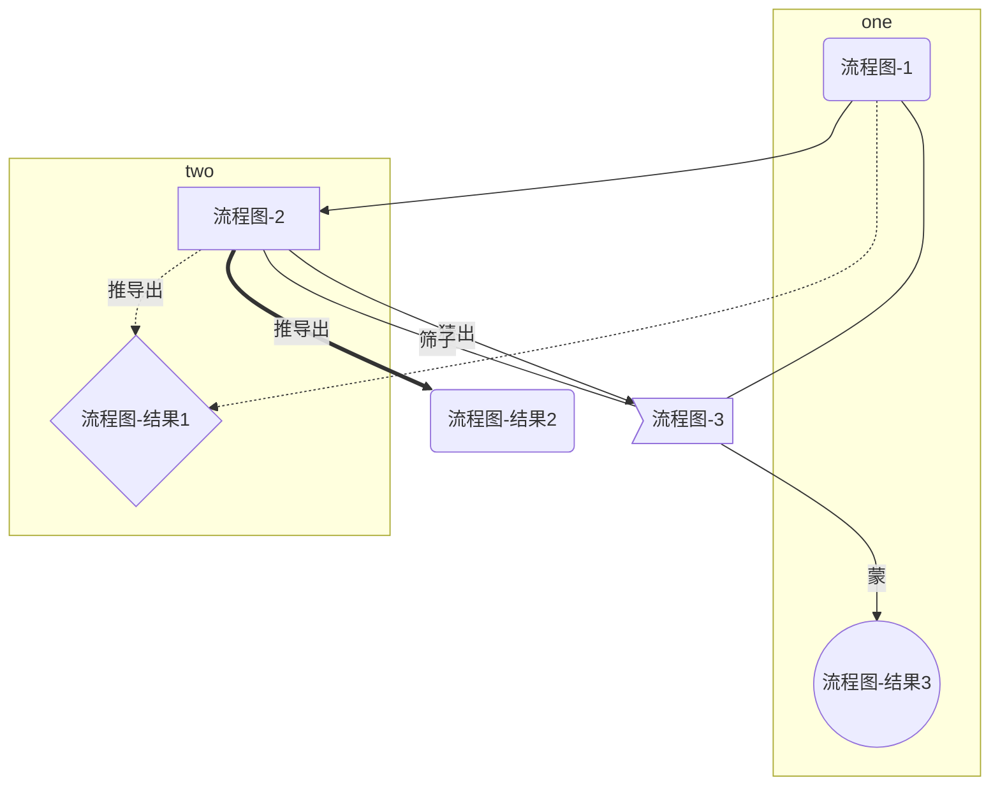
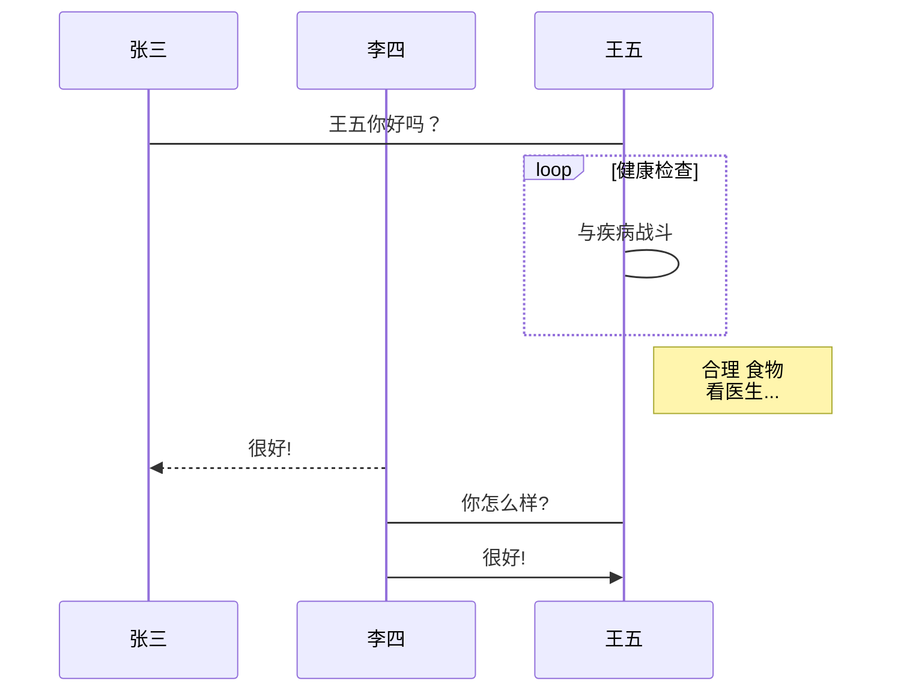
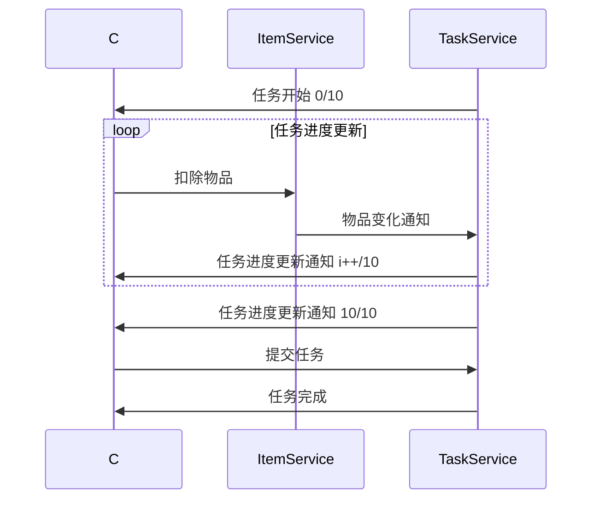
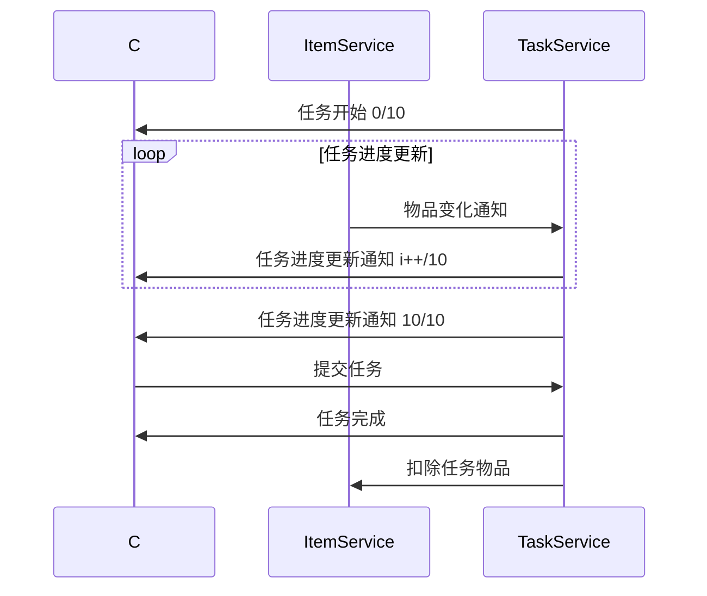
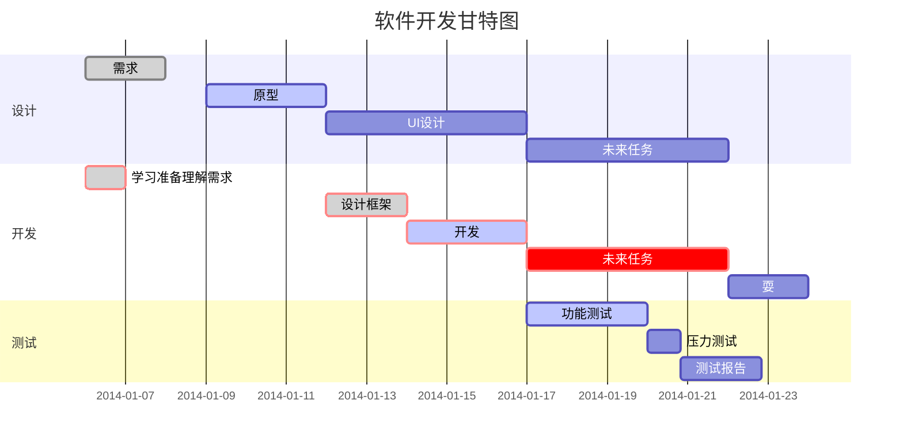

# <!-- 注释 -->标题1
<div style='display: none'> 注释 </div>

[comment]: <> (注释)
[//]: # (注释)
[^_^]: <> (注释)

&lt;http://example.com/ &gt; &emsp;&emsp;
&lt;http://example.com/ &gt;  
[link](https://note.youdao.com/)

### <span id="title">title</span>

- 任务清单
- [ ] 表示该项目未完成
- [x] 表示该项目已完成

文本内容行末两个空格换行  
下一行

- 空格大小  
  【1】 &emsp;或&#8195; //全角  
  【2】 &ensp;或&#8194; //半角  
  【3】 &nbsp;或&#160;  //半角之半角

<center>行中心对齐</center>
<p Align="left">行左对齐</p>
<p Align="right">行右对齐</p>

*斜体*或_斜体_  
**粗体**  
***加粗斜体***  
~~删除线~~  
<span style="border-bottom:2px dashed yellow;">下划线</span>

- [锚点](#title)

[Google][1]、[Leanote][2]。(结尾空行)

[1]:http://www.google.com
[2]:http://www.leanote.com

[^index.js]  
[^2]  
[^T]

[^index.js]:index.js
[^2]:package-lock.json
[^T]:package.json

1. 有序列表项 一
2. 有序列表项 二
3. 有序列表项 三

* 无序列表项 一
+ 无序列表项 二
- 无序列表项 三

<center>  <!--开始居中对齐-->


</center> <!--结束居中对齐-->

>>> 请问 Markdwon 怎么用？ - 小白  
>> x
>
>> sb
>>> ???
>
>> 自己看教程！ - 愤青
>
> 教程在哪？ - 小白

<font face="黑体">我是黑体字</font>
<font face="微软雅黑">我是微软雅黑</font>
<font face="STCAIYUN">我是华文彩云</font>
<font color=#0099ff size=12 face="黑体">黑体</font>
<font color=gray size=5>gray</font>
<font color=#00ffff size=3>null</font>

C语言里的函数 `scanf()` 怎么使用？  
四个空格 或 tab 插入代码

    #include &lt;stdio.h&gt;
    int main(void)
    {
        printf(&#34;Hello world\n&#34;);
    }

```js
console.log('hello world');
```

| 左对齐格式 | 右对齐格式 | 居中对齐格式 |
| :-----| ----: | :----: |
| 单元格 | 单元格 | 单元格 |
| 单元格 | 单元格 | 单元格 |













* * *
***
*****
- - -
---

